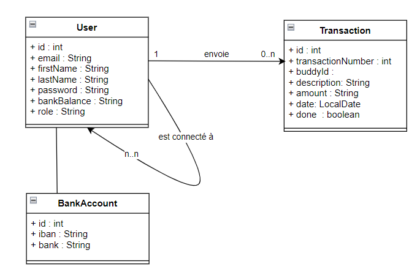

#Pay My Buddy / Project 6
C'est une appli qui permet aux clients de transférer de l'argent pour gérer leurs finances ou payer leurs amis.

### UML Diagram

### MPD Diagram

### Prerequisites

What things you need to install the software and how to install them

- Java 17
- Maven 3.8.5
- Mysql 8.0.29
- Lombok 1.18.24

### Installing

A step by step series of examples that tell you how to get a development env running:

1.Install Java:

https://docs.oracle.com/javase/8/docs/technotes/guides/install/install_overview.html

2.Install Maven:

https://maven.apache.org/install.html

3.Install MySql:

https://dev.mysql.com/downloads/mysql/

4.Install Lombock:

https://projectlombok.org/download

### Security

Passwords encrypted by Bcrypt.

https://bcrypt-generator.com/

### Using the API

Administrator
- ✉ Email : admin@mail.fr
- ✱ Password : user123

Users

- ✉ Email : mking@mail.fr
- ✱ Password : Gold

- ✉ Email : acall@mail.fr
- ✱ Password : Excalibur

- ✉ Email : jpoor@mail.fr
- ✱ Password : Nothing

- ✉ Email : bpicsou@mail.fr
- ✱ Password : Money

